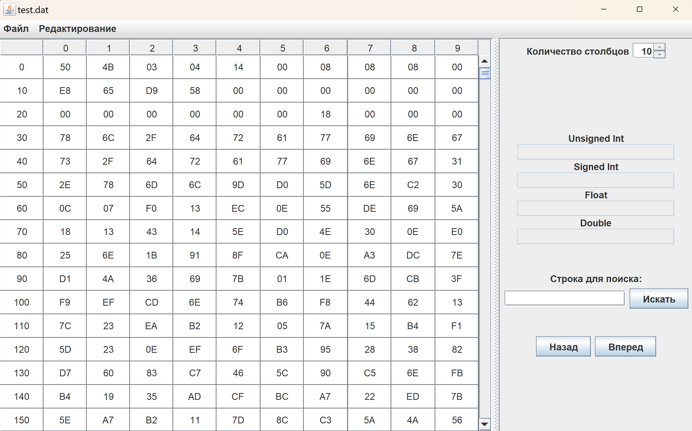
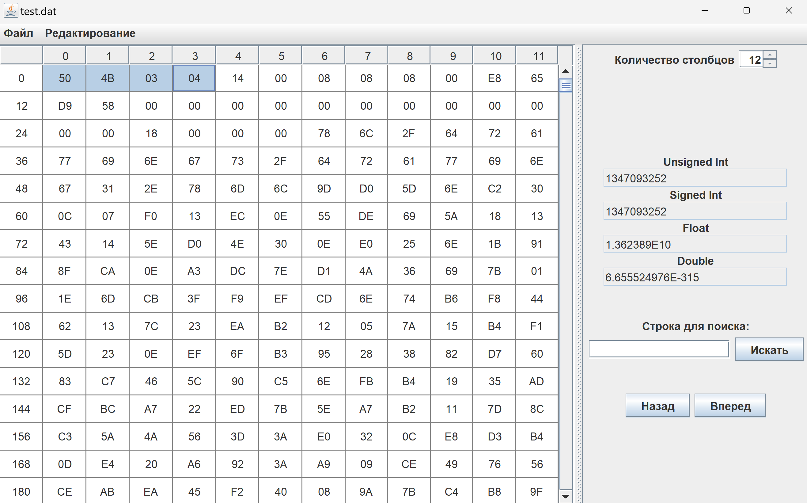
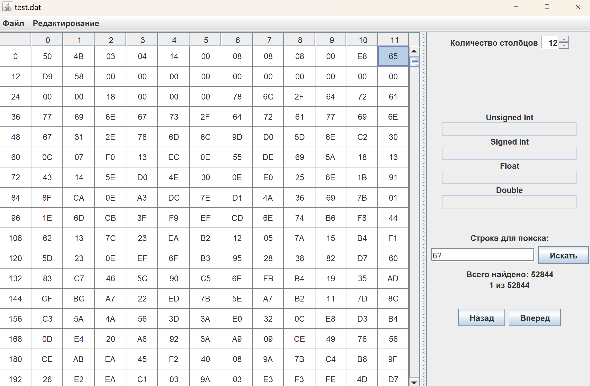

# HEX-редактор
Приложение для просмотра и редактирования файлов как последовательности байтов, отображаемых в виде шестнадцатеричных значений.

## Стек
* Java, Swing

## Функционал
* работа с большими файлами (через `RandomAccessFile` и блочную загрузку)
* табличное отображение с изменяемым количеством строк и столбцов
* выделенный байт под курсором с подсветкой и просмотром десятичного значения
* просмотр десятичных значений блоков по 2, 4, 8 байт
* поиск по точному значению или маске (`?` заменяет 1 символ)
* редактирование:
  * изменение значения отдельного байта
  * удаление одного или нескольких байт с обнулением либо сдвигом значений
  * вставка одного или нескольких байт с заменой либо сдвигом значений
  * вырезка, копирование и вставка блока байт

## Скриншоты работы

